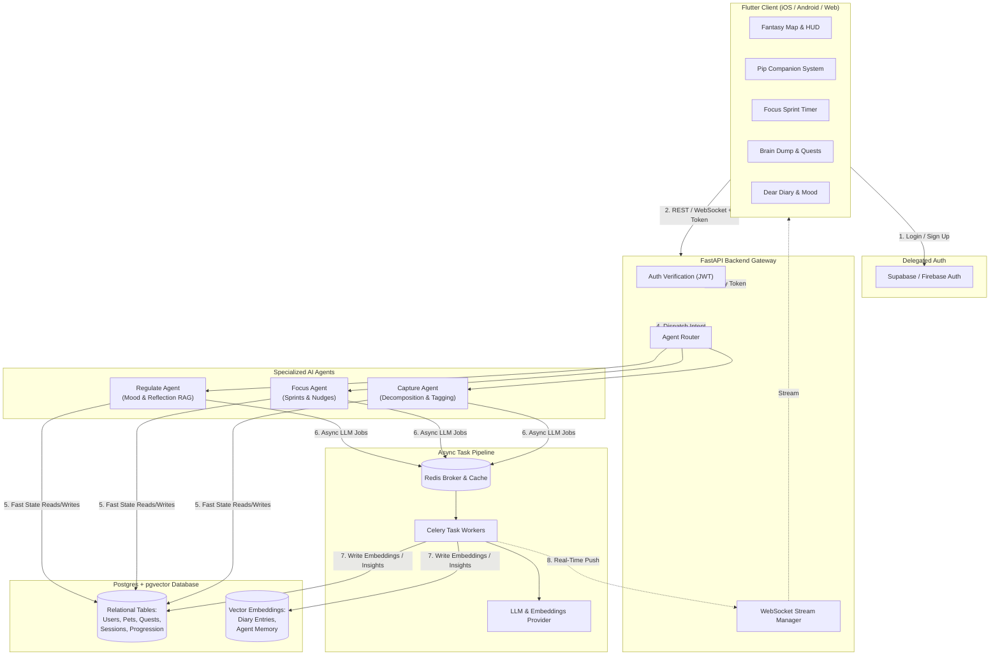
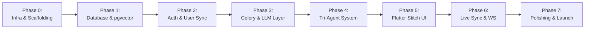

# FocusQuest — Phased Implementation Plan

This implementation plan translates the **FocusQuest System Architecture** ([architecture.md](file:///c:/Users/Hp/Desktop/works/FOCUS-QUEST/DOCS/architecture.md)) and the **Stitch UI Design System** into an actionable, phased delivery roadmap.

---

## Architecture & System Overview

FocusQuest is an ADHD-first gamified productivity companion that integrates:
1. **Frontend (Flutter)**: Cross-platform mobile/web UI featuring Pip the companion, a fantasy journey map, focus sprint timers, and daily reflection journals.
2. **Backend Gateway (FastAPI)**: REST + WebSocket gateway verifying delegated auth tokens and dispatching traffic through the Agent Router.
3. **Tri-Agent System**:
   - **Capture Agent**: Rapid thought capture, NLP parsing, and automated micro-task decomposition.
   - **Focus Agent**: Focus sprint management, anti-distraction nudges, and gamified XP/streak payouts.
   - **Regulate Agent**: Emotional check-ins, "Dear Diary" reflections, and similarity-based RAG memory search.
4. **Data & Queue Layer**: PostgreSQL + `pgvector` for relational state and vector embeddings, backed by Celery and Redis for asynchronous LLM orchestration.



---

## Implementation Roadmap (Phases 0 – 7)



---

### Phase 0: Infrastructure & Project Scaffolding
**Goal**: Establish local development environment, container orchestration, and dependency foundations.

#### Tasks:
1. **Container Orchestration (`infra/docker-compose.yml`)**:
   - PostgreSQL 16 container with `pgvector/pgvector:pg16` image.
   - Redis 7 container (`redis:7-alpine`) configured for Celery task queuing and lightweight caching.
   - FastAPI container configuration pointing to local mounts for hot-reloading.
   - Celery worker container sharing the backend application code.
2. **Environment Configuration (`infra/.env.example` & `.env`)**:
   - Database credentials, Redis URLs, Supabase/Firebase public keys/JWKS URLs, and LLM provider API keys (OpenAI / Google Gemini / Anthropic).
3. **Backend Dependencies (`backend/requirements.txt`)**:
   - `fastapi`, `uvicorn[standard]`, `pydantic`, `pydantic-settings`.
   - `sqlalchemy[asyncio]`, `asyncpg`, `psycopg2-binary`, `alembic`, `pgvector`.
   - `celery`, `redis`.
   - `google-genai` / `openai` / `httpx`.
   - `python-jose[cryptography]`, `passlib[bcrypt]`.
4. **FastAPI Application Entrypoint (`backend/app/main.py`)**:
   - Initialize FastAPI app with CORS middleware, lifespan events (database engine creation and redis connection pooling), and health-check endpoints (`/healthz`).
5. **Flutter Project Initialization (`frontend/pubspec.yaml`)**:
   - Setup dependencies: `flutter_riverpod`, `go_router`, `dio`, `web_socket_channel`, `supabase_flutter`, `intl`, `flutter_animate`, `google_fonts`, `lottie`.

#### Deliverables & Verification:
- `docker compose up` brings up Postgres (with pgvector enabled) and Redis without errors.
- `GET /healthz` returns `{"status": "healthy"}`.
- Flutter project compiles on emulator/web with a clean starter scaffold.

---

### Phase 1: Database Architecture & Vector Memory
**Goal**: Finalize relational schema and enable pgvector storage for agent memories and diary embeddings.

#### Tasks:
1. **Database Connection & Session Factory (`backend/app/db/session.py`)**:
   - Configure async SQLAlchemy engine (`create_async_engine`) and `async_sessionmaker`.
   - Create synchronous session factory for Celery workers.
2. **Schema Extension & DB Models (`backend/app/models/db_models.py`)**:
   - *Extend existing*: `User`, `Pet`, `Quest` (add tags, parent/subtask relations, recurring cadence).
   - *Add new models*:
     - `FocusSession`: `session_id`, `user_id`, `quest_id`, `duration_minutes`, `actual_duration`, `status` (`started`, `completed`, `interrupted`), `distraction_count`, `xp_awarded`.
     - `DistractionLog`: `log_id`, `session_id`, `user_id`, `thought_content`, `created_at` (for the "Park a Thought" ADHD feature).
     - `DiaryEntry`: `entry_id`, `user_id`, `mood_score`, `mood_tags`, `raw_text`, `ai_reflection`, `created_at`.
     - `AgentMemory` (pgvector): `memory_id`, `user_id`, `source_type` (`diary`, `focus_habit`, `preference`), `content`, `embedding` (`Vector(1536)` or `Vector(768)` depending on embedding model), `metadata_json`.
     - `MapNode` & `UserMapProgression`: `node_id`, `zone_id`, `title`, `required_xp`, `is_unlocked`, `is_completed`.
3. **Vector Extension Init (`databases/init/enable_pgvector.sql`)**:
   - `CREATE EXTENSION IF NOT EXISTS vector;`
4. **Alembic Migrations (`backend/alembic/versions/`)**:
   - Generate and test migration `0004_create_focus_diary_memory_tables.py`.
   - Add IVFFlat or HNSW vector index on `agent_memory.embedding` for cosine similarity search (`vector_cosine_ops`).

#### Deliverables & Verification:
- All tables and enums migrate cleanly on clean database boot.
- Integration test inserts a dummy vector into `agent_memory` and executes a nearest-neighbor query (`<=>` operator).

---

### Phase 2: Authentication & Delegated User State
**Goal**: Implement Supabase/Firebase client-side auth with secure backend token verification.

#### Tasks:
1. **Client Auth Flow (Flutter)**:
   - Configure Supabase / Firebase SDK in Flutter app.
   - Implement Auth Repository supporting Email/Password and OAuth (Google).
   - Save session JWT securely with auto-refresh mechanism.
2. **Backend Auth Verification Dependency (`backend/app/api/v1/deps.py`)**:
   - FastAPI HTTPBearer security scheme.
   - Verify JWT signatures against JWKS endpoint.
   - Extract `sub` (user UUID) and sync with local `users` table via `get_or_create_user`.
3. **User Profile & Onboarding API (`backend/app/api/v1/routes/users.py`)**:
   - `GET /api/v1/users/me`: Return current user profile, active pet stats, and current map progress.
   - `POST /api/v1/users/onboarding`: Set initial ADHD baseline (preferred sprint duration, egg selection, notification preferences).

#### Deliverables & Verification:
- Authenticated requests to protected endpoints succeed with valid JWT and reject invalid/expired tokens (HTTP 401).
- First login automatically creates a corresponding record in `users` and assigns an initial egg `Pet`.

---

### Phase 3: Async Task Queue & LLM Provider Layer
**Goal**: Build a decoupled background task worker system for all non-blocking AI operations.

#### Tasks:
1. **Celery Worker Configuration (`backend/app/tasks/celery_app.py`)**:
   - Setup Celery app with Redis broker and Redis/Postgres result backend.
   - Task serialization config (`json`) and retry/exponential backoff strategies.
2. **Unified LLM & Embeddings Client (`backend/app/llm/client.py`)**:
   - Provider-agnostic abstraction for LLM completions (Structured Outputs via JSON schema) and vector embeddings.
   - Swappable providers: Google Gemini, OpenAI, or Anthropic.
   - Error handling, timeouts, and rate-limit guardrails.
3. **Background Worker Tasks (`backend/app/tasks/worker_tasks.py`)**:
   - `task_decompose_quest(quest_id, raw_input)`: Subtask breakdown and priority scoring.
   - `task_generate_diary_reflection(entry_id, user_id)`: Summarize reflection, extract mood tags, embed content, and save to `agent_memory`.
   - `task_generate_focus_nudge(session_id, user_id)`: Craft personalized encouragement or check-in based on past focus habits.
4. **Vector Search Utility (`backend/app/db/embeddings.py`)**:
   - Helper function `query_similar_memories(user_id, query_text, top_k=5)` returning contextual memory snippets for LLM prompting.

#### Deliverables & Verification:
- Triggering a Celery task asynchronously performs the LLM call, saves the result into Postgres, and returns within acceptable background latency.

---

### Phase 4: Tri-Agent System & API Endpoints
**Goal**: Implement the three specialized agents and expose clean REST/WebSocket gateways.

#### Tasks:
1. **Agent Router (`backend/app/agents/router.py`)**:
   - Dispatch requests based on explicit route tags or lightweight intent classifier (`capture` vs `focus` vs `regulate`).
2. **Capture Agent (`backend/app/agents/capture_agent.py` & `/routes/capture.py`)**:
   - *Brain Dump Endpoint*: `POST /api/v1/capture/braindump` parses unstructured thoughts into actionable quests, subtasks, and quick notes.
   - *Task Breakdown Endpoint*: `POST /api/v1/quests/{id}/breakdown` breaks large, intimidating tasks into 5–15 minute micro-steps (reducing ADHD executive dysfunction).
3. **Focus Agent (`backend/app/agents/focus_agent.py` & `/routes/focus.py`)**:
   - *Session Lifecycle*: `POST /api/v1/focus/start`, `POST /api/v1/focus/pause`, `POST /api/v1/focus/complete`.
   - *Distraction Parking*: `POST /api/v1/focus/park-thought` allows users to offload intrusive thoughts into `DistractionLog` without abandoning their sprint.
   - *Gamification Engine*: Award XP, evaluate pet mood boost, level up Pip, and unlock journey map nodes upon completion.
4. **Regulate Agent (`backend/app/agents/regulate_agent.py` & `/routes/diary.py`, `/routes/regulate.py`)**:
   - *Mood & Reflection*: `POST /api/v1/diary/entries` accepts mood logs and reflection text.
   - *RAG Context Retrieval*: Uses past diary embeddings to generate empathetic, continuity-aware responses from Pip ("Remember last week when you felt like this? Going for a 5-minute walk helped unlock your focus.").

#### Deliverables & Verification:
- REST endpoints pass full request/response cycle tests with simulated agent workflows.

---

### Phase 5: Flutter Client & Stitch UI Implementation
**Goal**: Build the user interface according to the Stitch design specifications with ADHD-friendly UX principles.

```
┌─────────────────────────────────────────────────────────────┐
│                      FLUTTER CLIENT                         │
├──────────────┬──────────────┬──────────────┬────────────────┤
│ 1. Onboard   │ 2. Journey   │ 3. Quest &   │ 4. Focus &     │
│    & Auth    │    Map & Pip │    Capture   │    Diary       │
├──────────────┼──────────────┼──────────────┼────────────────┤
│ - Login /    │ - Fantasy    │ - Brain Dump │ - Sprint Timer │
│   Register   │   Path Map   │   Modal      │   Dial         │
│ - Egg Hatch  │ - Pip Avatar │ - Micro-Task │ - "Park Idea"  │
│   Selection  │   Widget     │   Cards      │ - Dear Diary   │
│ - ADHD Prefs │ - Action HUD │ - XP Badges  │   Reflection   │
└──────────────┴──────────────┴──────────────┴────────────────┘
```

#### Tasks:
1. **Design Tokens & Theme Setup (`frontend/lib/core/theme/`)**:
   - Color palettes: Low-saturation pastels, calm high-contrast dark mode, clear visual hierarchy (eliminating visual clutter).
   - ADHD accessibility: Font readability (OpenDyslexic or clean sans-serif like Google Sans), haptic feedback switches, reduced animation toggle.
2. **Screen 1: Onboarding & Pet Selection**:
   - Interactive Egg selection (Pip's starting form).
   - Baseline survey: preferred focus sprint length (15m, 25m, 45m), primary focus hurdles.
3. **Screen 2: Home Dashboard & Journey Map (`frontend/lib/features/map/`)**:
   - Interactive fantasy map showing quest nodes, milestone checkpoints, and level progression.
   - Pip Companion HUD: Dynamic sprite/Lottie displaying current mood, XP bar, hunger/energy, and speech bubbles.
4. **Screen 3: Brain Dump & Quest Board (`frontend/lib/features/quests/`)**:
   - Quick Capture button opening a low-friction speech-to-text / text modal.
   - Quest Cards showing difficulty badges, XP payouts, and "Break down with Pip" AI action.
   - Subtask checklist with celebratory micro-animations on completion.
5. **Screen 4: Focus Sprint Timer (`frontend/lib/features/focus/`)**:
   - Clean, non-distracting countdown dial with ambient sound / visual progress.
   - "Park a Thought" quick input drawer to catch wandering thoughts without breaking focus.
   - Post-sprint celebration screen: XP tally, Pip evolution check, and node unlock fanfare.
6. **Screen 5: "Dear Diary" & Emotional Regulation (`frontend/lib/features/diary/`)**:
   - Quick mood selector (emojis + energy level sliders).
   - Conversational journal dialogue with Pip displaying RAG-grounded encouragement.

#### Deliverables & Verification:
- All primary screens navigable via `go_router` with state managed via Riverpod and simulated API data.

---

### Phase 6: Real-Time Communication & Full Integration
**Goal**: Connect Flutter frontend to FastAPI backend via REST and WebSockets for streaming agent responses.

#### Tasks:
1. **WebSocket Infrastructure (`backend/app/api/v1/routes/ws.py`)**:
   - Authenticated WebSocket endpoint `/api/v1/ws/{client_id}`.
   - Broadcast and channel subscriptions for:
     - Real-time LLM token streaming for Pip's conversational responses.
     - Live focus session events and gentle nudge notifications.
2. **Client-Side WebSocket Service (`frontend/lib/core/network/`)**:
   - Auto-reconnecting WebSocket client with heartbeat/ping-pong.
   - Stream listeners integrated into Riverpod providers for live UI updates.
3. **Offline Caching & Optimistic Updates**:
   - Local persistence using `hive` or `sqflite` on Flutter client for offline task checkoffs and local timer operation when offline.

#### Deliverables & Verification:
- Start a focus sprint or braindump in Flutter -> backend processes in Celery -> updates stream in real-time back to Flutter UI.

---

### Phase 7: Gamification Tuning, ADHD Testing & Production Deployment
**Goal**: Balance gameplay progression, conduct accessibility audits, and deploy to cloud environments.

#### Tasks:
1. **Gamification Balancing**:
   - Tune XP curves for pet growth: Egg (0 XP) -> Hatchling (200 XP) -> Juvenile (800 XP) -> Adult (2000 XP).
   - Implement streak forgiveness: Missing a day doesn't wipe progress to zero (prevents ADHD shame spirals).
2. **Accessibility & Usability Testing**:
   - Touch targets $\ge 48\times 48\text{ px}$.
   - Full keyboard navigation and screen reader audits on Flutter web/mobile.
3. **Production Deployment Setup**:
   - Docker image build & optimization (multi-stage builds for FastAPI and Flutter Web).
   - Cloud deployment configuration (e.g. Google Cloud Run or AWS ECS for FastAPI & Celery; managed PostgreSQL + pgvector on Supabase / Cloud SQL; managed Redis).
   - CI/CD workflows for linting, unit testing, and automated builds.

---

## Detailed Task Matrix & File Ownership

| Phase | Component | Key Files | Primary Tech |
|---|---|---|---|
| **0** | Infra & Setup | `infra/docker-compose.yml`, `backend/requirements.txt`, `frontend/pubspec.yaml` | Docker, Python 3.12, Flutter 3.x |
| **1** | DB & Vector | `backend/app/models/db_models.py`, `backend/alembic/versions/`, `backend/app/db/session.py` | SQLAlchemy 2.0, asyncpg, pgvector |
| **2** | Auth & Users | `backend/app/api/v1/deps.py`, `frontend/lib/features/auth/` | Supabase/Firebase Auth, PyJWT |
| **3** | Async LLM | `backend/app/tasks/celery_app.py`, `backend/app/tasks/worker_tasks.py`, `backend/app/llm/client.py` | Celery, Redis, Google GenAI / OpenAI |
| **4** | 3 AI Agents | `backend/app/agents/capture_agent.py`, `focus_agent.py`, `regulate_agent.py`, `router.py` | FastAPI, Pydantic, pgvector RAG |
| **5** | Stitch Flutter UI | `frontend/lib/features/map/`, `quests/`, `focus/`, `diary/`, `pet/` | Flutter, Riverpod, Google Fonts |
| **6** | WebSockets | `backend/app/api/v1/routes/ws.py`, `frontend/lib/core/network/ws_client.dart` | WebSockets, Asyncio Channels |
| **7** | Deploy & Launch | `backend/Dockerfile`, `.github/workflows/ci.yml`, Release builds | Cloud Run / ECS, Docker |
